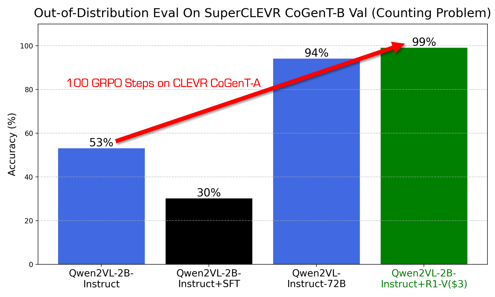
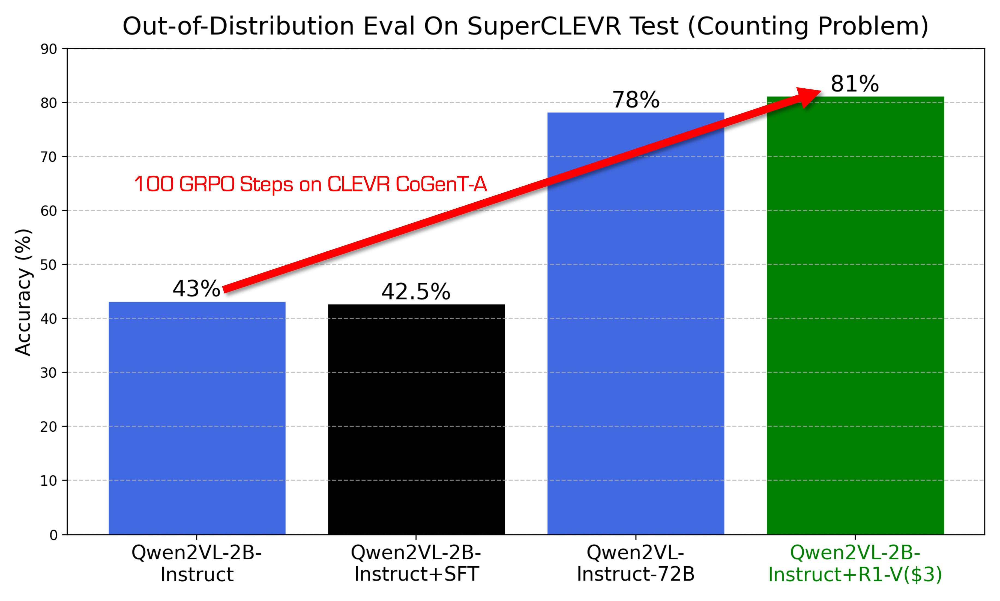
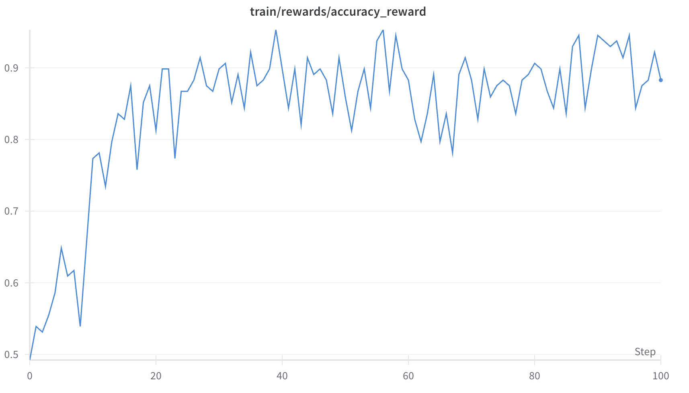

# R1-V: Reinforce Super Generalization Ability in Vision Langauge Models with Less Than $3

*Contributors: Liang Chen, Lei Li, Haozhe Zhao, Yifan Song*

1. We firstly reveal that **Reinforcement Learning with Verifiable Rewards (RLVR)** outperforms chain-of-thought supervised fine-tuning (CoT-SFT) in both **effectiveness and out-of-distribution (OOD) robustness** for vision language models.

2. In our experiment, we **incentivize** VLMs to learn **generalizable** visual counting abilities, rather than overfitting to the training set.

3. The 2B model outperforms the 72B model in OOD tests within just **100** training steps.

4. The training was conducted on 8 A100 GPUs for **30 minutes, costing $2.62**.

5. Codes, models, datasets, more details and **all open-source** resources will be shared (within CNY holidays).


---









## Citation

```bib
@misc{R1-V,
author       = {Liang Chen and Lei Li and Haozhe Zhao and Yifan Song},
title        = {R1-V: Reinforce Super Generalization Ability in Vision Langauge Models with Less Than $3},
howpublished = {https://github.com/Deep-Agent/R1-V},
note         = {Accessed: 2025-02-02},
year         = {2025}
}

```


