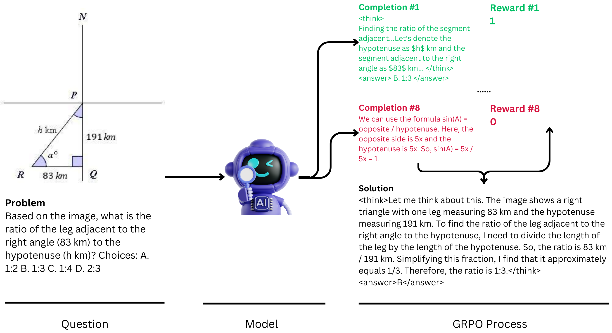

# Multimodal Open R1

We conducted a speed-run on to investigate R1's paradigm in multimodal models after observing growing interest in R1 and studying the elegant implementation of the GRPO algorithm in `open-r1` and `trl`.

[🤗 Models](https://huggingface.co/lmms-lab/Qwen2-VL-2B-GRPO-8k) | [🤗 Datasets](https://huggingface.co/datasets/lmms-lab/multimodal-open-r1-8k-verified) | [Wandb Logs](https://api.wandb.ai/links/libo0013/lz60ml8h)

> [!NOTE] 
> Although our insights may not be guaranteed to be correct, we commit to sharing them truthfully and honestly. We welcome community feedback and discussions to improve our understanding on multimodal reasoning models. We will PR to `open-r1` later to better support community study on multimodal RL.



**What We Did**
- Implemented Multimodal R1 based on [huggingface/open-r1](https://github.com/huggingface/open-r1) and [deepseek-ai/DeepSeek-R1](https://github.com/deepseek-ai/DeepSeek-R1). 
  - Integrated Qwen2-VL series, Aria-MoE, and other VLMs available in `transformers`.
- Open-sourced the first batch of `8k` multimodal RL training examples focused on Math reasoning. The data is created by GPT4o with reasoning paths and verifiable answers, based on `Math360K` and `Geo170K`. We provide a [script](local_scripts/create_vision_cot_data.py) for users to inspect and create their own data.
  - The dataset is available in [lmms-lab/multimodal-open-r1-8k-verified](https://huggingface.co/datasets/lmms-lab/multimodal-open-r1-8k-verified).
- Open-sourced models trained with GRPO.
  - The models are available in [lmms-lab/Qwen2-VL-2B-GRPO-8k](https://huggingface.co/lmms-lab/Qwen2-VL-2B-GRPO-8k) | [lmms-lab/Qwen2-VL-7B-GRPO-8k](https://huggingface.co/lmms-lab/Qwen2-VL-7B-GRPO-8k).

**Insights and Future Plans**
- Multiple-choice option verification is necessary since many math multimodal problems are MCQs. Discussed in [issue#56](https://github.com/huggingface/open-r1/issues/56) and we customize the verification logic in [src/open_r1/grpo.py](src/open_r1/grpo.py).
- Need to curate RL data to be verifiable, requiring further exploration on effectively converting existing data into RL data and validating GPT4o's curation reliability.
- Current framework is not efficient for large-scale training. Qwen2-VL-2B model takes `10 hours` to train `1 epoch` on `8 H100 GPUs` for `8k samples`. So it's necessary to investigate how to efficiently scale up the training.
- Our init model (Qwen2-VL-2/7B-Instruct) do not show good reasoning ability in our experiments, and during training, the model quickly gather rewards from `format` but not `accuracy`, which is not a good sign for whole RL training. We release our [wandb logs](https://api.wandb.ai/links/libo0013/lz60ml8h) for reference.

  

- The community may need to curate better multimodal dataset for RL training. Current dataset is limited to math scenarios since it has verifiable answers. It's unclear how to expand the RL dataset to other general domains with open-ended answer. We welcome community feedback on our current strategy and plan to release a larger dataset if we get clear scaling insights through community discussions.


## Training Models

> [!NOTE]
> The training commands below are configured for a node of 8 x H100s (80GB). For different hardware and topologies, you may need to tune the batch size and number of gradient accumulation steps.

### GRPO on Qwen2-VL-2/7B

To run GRPO on Qwen2-VL-2B:

```
cd /home/tiger/multimodal-open-r1
# pip3 install vllm==0.6.6.post1
pip3 install -e ".[dev]"

pip3 install wandb==0.18.3

torchrun --nproc_per_node="${ARNOLD_WORKER_GPU}" \ # 8
    --nnodes="${ARNOLD_WORKER_NUM}" \ # 1
    --node_rank="${ARNOLD_ID}" \ # 0
    --master_addr="${METIS_WORKER_0_HOST}" \ # 127.0.0.1
    --master_port="${port_in_cmd}" \ # 12345
    src/open_r1/grpo.py \
    --deepspeed scripts/zero3.json \
    --output_dir checkpoints/Qwen2-VL-2B-GRPO-8k \
    --model_name_or_path Qwen/Qwen2-VL-2B-Instruct \
    --dataset_name lmms-lab/multimodal-open-r1-8k-verified \
    --max_prompt_length 8192 \
    --per_device_train_batch_size 1 \
    --gradient_accumulation_steps 1 \
    --logging_steps 1 \
    --bf16 \
    --report_to wandb \
    --gradient_checkpointing true \
    --attn_implementation flash_attention_2 \
    --max_pixels 2359296 \
    --save_total_limit 8 \
    --num_train_epochs 1 \
    --run_name Qwen2-VL-2B-GRPO-8k
```

Please refer to [local_scripts/train_qwen2_vl.sh](local_scripts/train_qwen2_vl.sh) for more details.

Above scripts are naively for `multi-gpu/multi-node` training.

### Reasoning matters for evaluation

Many benchmarks, such as MMMU and AI2D, require the model to directly output an answer without providing reasoning steps. This raises a critical issue for evaluation: does the model truly understand how to derive the answer or is it just guessing or relying on memorization? To address this, we require the model to first generate its reasoning steps before providing the final answer. We then use GPT-4o to extract and score the responses.

We tested the original Qwen2-VL-2B-Instruct and Qwen2-VL-7B-Instruct models and observed that their scores decreased on certain benchmarks when reasoning steps were included. Subsequently, we compared the scores of our model using the same evaluation method. Our model performed better under the reasoning-based chain-of-thought (CoT) setting. We attribute this improvement to our model’s training on GRPO, which appears to enhance its ability to handle reasoning formats and consequently achieve higher scores.

| Benchmarks     | Qwen2-VL-2B-Instruct(w.o reasoning) | Qwen2-VL-2B-Instruct(w. reasoning) | Qwen2-VL-2B-GRPO-8k(w. reasoning) | Qwen2-VL-7B-Instruct(w.o reasoning) | Qwen2-VL-7B-Instruct(w. reasoning) | Qwen2-VL-7B-GRPO-8k(w. reasoning) |
|----------------|-------------------------------------|------------------------------------|-----------------------------------|-------------------------------------|------------------------------------|-----------------------------------|
| MMMU           | 39.7                                | 31.2                               | 35.22                             | 50.8                                | 41.9                               | 49.4                              |
| Mathvista-mini | 51.6                                | 48.6                               | 49.4                              | 57.1                                | 60.9                               | 60.6                              |

In our logs, we sometimes find out that the model still just outputing the answer with our the reasoning steps (even for our trained models). We believe that this could because the model are not familiar with the reasoning steps and can't decide how to generate it.

### Evaluating models

We use [lmms-eval]([https://github.com/LMMs-Lab/lmms-eval](https://github.com/EvolvingLMMs-Lab/lmms-eval)) to evaluate models, please run:

```shell
bash local_scripts/lmms_eval_qwen2vl.sh
```

To reproduce our result on the above benchmarks, please checkout to the `dev/qwen_cot` branch.

Visual reasoning task evaluation currently are limited in direct answer format and simple parsing logic. Tasks like `mmmu_val`, `mathvista_testmini`, and `mmmu_pro` expect direct answers rather than reasoning traces, and the current parsing logic cannot process step-by-step reasoning. We are actively working on improving this limitation and welcome community contributions to develop a more comprehensive evaluation framework for visual reasoning models.

### RL Data Generation

We provide the first batch of `8k` multimodal RL training examples focused on Math reasoning. The data is generated by GPT4o. We provide the [script](local_scripts/create_vision_cot_data.py) to users to inspect and create their own data.

Users can view data in [lmms-lab/multimodal-open-r1-8k-verified](https://huggingface.co/datasets/lmms-lab/multimodal-open-r1-8k-verified). The problem/solution are generated by GPT4o with reasoning path and verifiable answer. The `original question`/`original answer` are from the original dataset.
